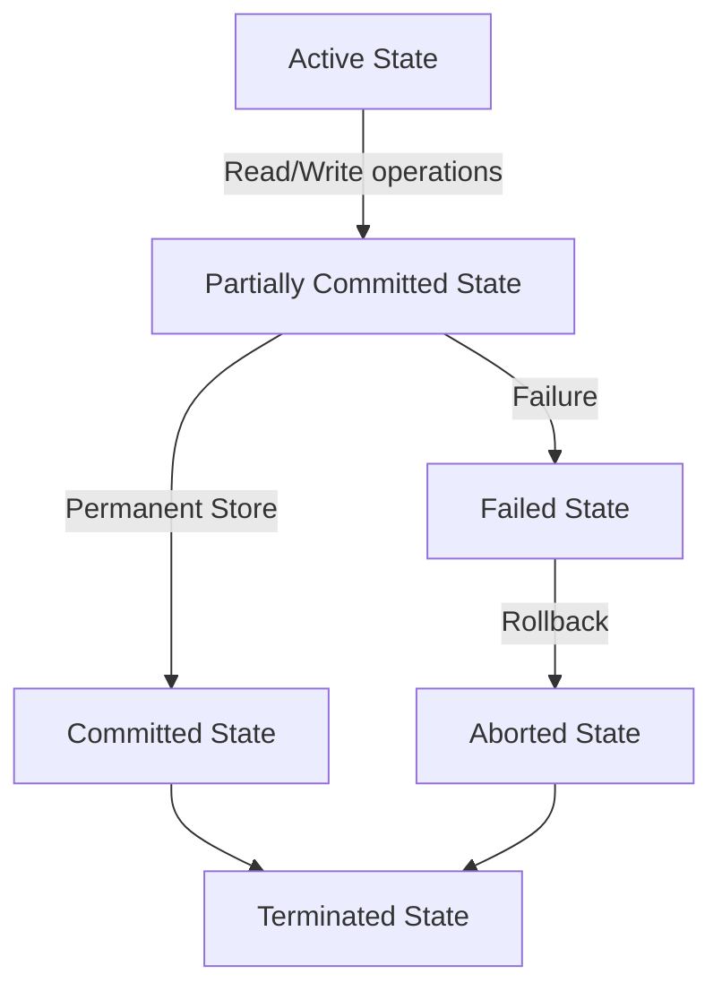

# Transaction
A transaction is a sequence of one or more SQL statements that are executed as a single unit of work. Transactions are used to ensure data integrity and consistency in a database. They allow you to group multiple operations together, so that either all of the operations succeed or none of them do.

## ACID Properties
Transactions have four key properties, known as ACID properties:
1. ***Atomicity***: This property ensures that all operations within a transaction are treated as a single unit. If any operation fails, the entire transaction is rolled back, and the database remains unchanged.
2. ***Consistency***: This property ensures that a transaction brings the database from one valid state to another valid state. It ensures that any transaction will leave the database in a consistent state, even if it fails.
3. ***Isolation***: This property ensures that the operations of one transaction are isolated from the operations of other transactions. This means that the changes made by one transaction are not visible to other transactions until the first transaction is committed.
4. ***Durability***: This property ensures that once a transaction is committed, its changes are permanent and will survive any subsequent system failures. Even if the database crashes after a transaction is committed, the changes made by that transaction will not be lost.


## Transaction States
1. *** Active State ***
- It is the first stage of any transaction when it has begun to execute. The execution of the transaction takes place in this state.
- Operations such as insertion, deletion, or updation are performed during this state.
- During this state, the data records are under manipulation and they are not saved to the database, rather they remain somewhere in a buffer in the main memory.

2. ***  Partially Committed***
- The transaction has finished its final operation, but the changes are still not saved to the database.
- After completing all read and write operations, the modifications are initially stored in main memory or a local buffer. If the changes are made permanent in the database then the state will change to "committed state" and in case of failure it will go to the "failed state". 
3. ***  Committed***
This state of transaction is achieved when all the transaction-related operations have been executed successfully along with the Commit operation, i.e. data is saved into the database after the required manipulations in this state. This marks the successful completion of a transaction.

4. ***  Failed State***
If any of the transaction-related operations cause an error during the active or partially committed state, further execution of the transaction is stopped and it is brought into a failed state. Here, the database recovery system makes sure that the database is in a consistent state.

5. ***  Aborted State***
If a transaction reaches the failed state due to a failed check, the database recovery system will attempt to restore it to a consistent state. If recovery is not possible, the transaction is either rolled back or cancelled to ensure the database remains consistent.

In the aborted state, the DBMS recovery system performs one of two actions:

Kill the transaction: The system terminates the transaction to prevent it from affecting other operations.
Restart the transaction: After making necessary adjustments, the system reverts the transaction to an active state and attempts to continue its execution.
6. ***  Terminated State***
It refers to the final state of a transaction, indicating that it has completed its execution. Once a transaction reaches this state, it has either been successfully committed or aborted. In this state, no further actions are required from the transaction, as the database is now stable.




## Transaction Control Commands
1. ***BEGIN TRANSACTION***: This command is used to start a new transaction. It indicates the beginning of a transaction block.
2. ***COMMIT***: This command is used to save the changes made by a transaction to the database. Once a transaction is committed, its changes become permanent and visible to other transactions.
3. ***ROLLBACK***: This command is used to undo the changes made by a transaction. If a transaction encounters an error or if the user decides to cancel the transaction, the ROLLBACK command can be used to revert the database to its previous state before the transaction began.


Example:

Before using transactions, if we want to transfer money from one account to another, we might execute the following SQL statements:
```sql
UPDATE accounts SET balance = balance - 100 WHERE account_id = 1;
UPDATE accounts SET balance = balance + 100 WHERE account_id = 2;
```

If sql statement 1 executes successfully but statement 2 fails (e.g., due to a network issue), the first account will have 100 less, but the second account will not receive the 100, leading to an inconsistent state.

To ensure that both operations succeed or fail together, we can use a transaction:
```sql
BEGIN TRANSACTION;
UPDATE accounts SET balance = balance - 100 WHERE account_id = 1;
UPDATE accounts SET balance = balance + 100 WHERE account_id = 2;
COMMIT;
```

Because both operations are part of the same transaction, if either of them fails, the entire transaction will be rolled back, ensuring that the database remains in a consistent state.


## Transaction Operations
- ***Read Operation***: This operation retrieves data from the database. It does not modify the data and is used to view or analyze information.
Example: 
```sql
SELECT * FROM accounts WHERE account_id = 1;
```

- ***Write Operation***: This operation modifies the data in the database. It includes operations such as INSERT, UPDATE, and DELETE.
Example:
```sql
UPDATE accounts SET balance = balance - 100 WHERE account_id = 1;
````

- ***Commit Operation***: This operation saves the changes made by a transaction to the database. Once a transaction is committed, its changes become permanent and visible to other transactions.
Example:
```sql
COMMIT;
```

- ***Rollback Operation***: This operation undoes the changes made by a transaction. If a transaction encounters an error or if the user decides to cancel the transaction, the ROLLBACK command can be used to revert the database to its previous state before the transaction began.
Example:
```sql
ROLLBACK;
```


# Schedule and Serializability
