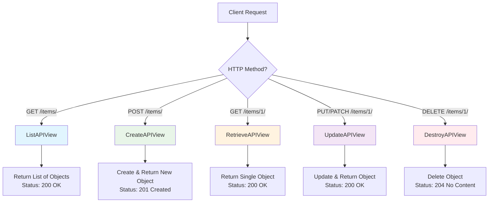
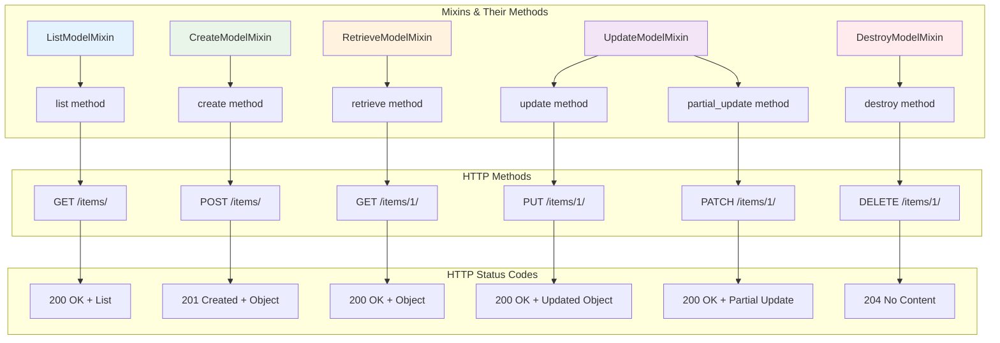
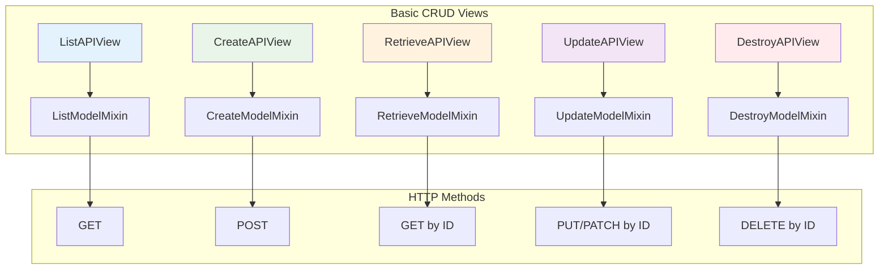
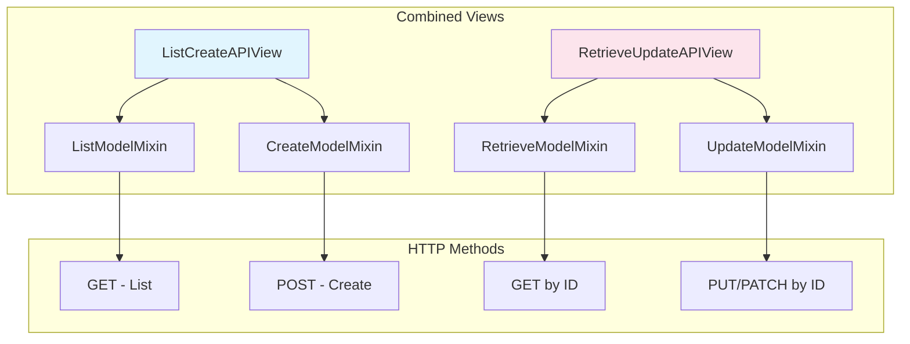
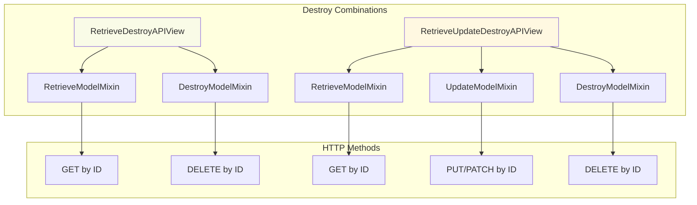
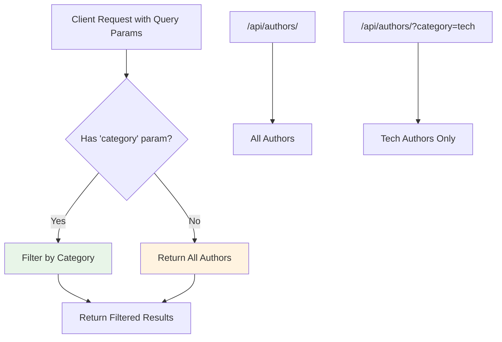
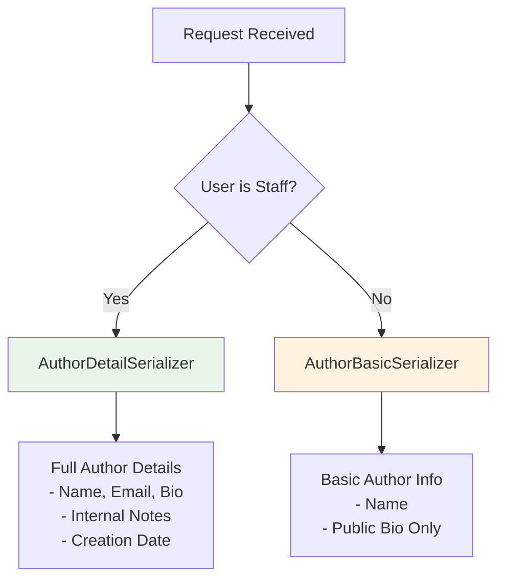
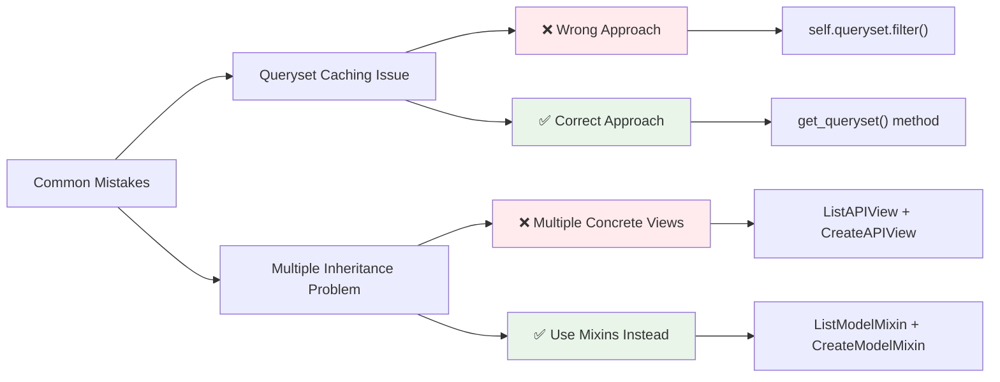
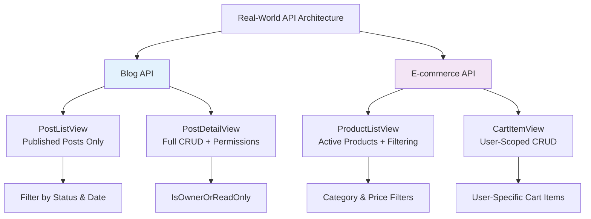
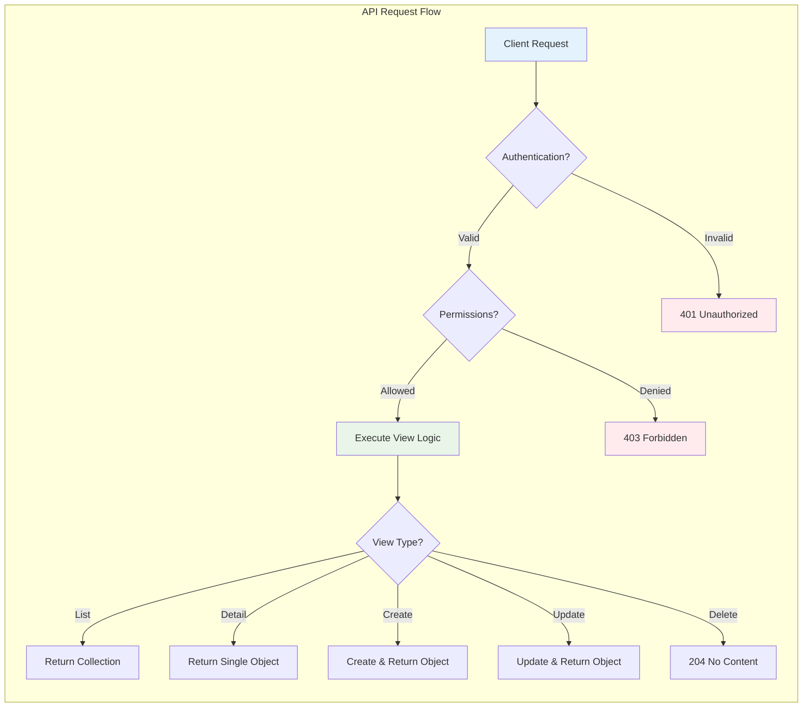

# Django REST Framework Generic Views - Complete Guide


##  What Are Generic Views?

Generic views are **pre-built view classes** in Django REST Framework that handle common patterns in web development and eliminate boilerplate code. They provide a consistent interface for:

- **Listing** objects (GET collection)
- **Creating** new objects (POST)
- **Retrieving** single objects (GET by ID)
- **Updating** existing objects (PUT/PATCH)
- **Deleting** objects (DELETE)

These views help reduce repetitive code and provide standardized responses for common CRUD operations.



---

##  Core Attributes of Generic Views

### Essential Attributes
- **`queryset`** - The queryset that should be used for returning objects from this view. Typically, you must either set this attribute, or override the `get_queryset()` method.
- **`serializer_class`** - The serializer class that should be used for validating and deserializing input, and for serializing output. Typically, you must either set this attribute, or override the `get_serializer_class()` method.
- **`lookup_field`** - The field used to look up objects in the database (default: `pk`)

### Example Setup
```python
class AuthorListView(ListAPIView):
    queryset = Author.objects.all()
    serializer_class = AuthorSerializer
    lookup_field = 'id'  # Optional, defaults to 'pk'
```

---

##  Base Methods of Generic Views 

### `get_queryset()`
Returns the queryset that should be used for list views, and that should be used as the base for lookups in detail views. Defaults to returning the queryset specified by the queryset attribute.

This method should always be used rather than accessing self.queryset directly, as self.queryset gets evaluated only once, and those results are cached for all subsequent requests.

```python
def get_queryset(self):
    user = self.request.user
    return user.accounts.all()
```

** Important:** Always use `get_queryset()` instead of accessing `self.queryset` directly to avoid caching issues.

### `get_serializer_class()`
**Returns the serializer class dynamically**

Defaults to returning the serializer class specified by the `serializer_class` attribute. May be overridden to provide dynamic behavior, such as returning a serializer class that is specific to the user making the request.

```python
def get_serializer_class(self):
    if self.request.user.is_authenticated:
        return AuthenticatedSerializer
    return AnonymousSerializer
```

---


### `get_object()`
**Returns a single object based on the lookup field**
This method is used to retrieve a single object from the database based on the `lookup_field`. It raises a `404 Not Found` error if the object does not exist.

```python
def get_object(self):
    pk= self.kwargs.get('pk')
    try:
        return Author.objects.get(pk=pk)
    except Author.DoesNotExist:
        raise Http404("Author not found")
```


##  Mixins in Django REST Framework (GenericAPIView)

Mixins are **reusable components** that can be used to add specific functionality to views. They allow you to combine different behaviors without having to create a new class for each combination.



### Available Mixins

#### `ListModelMixin`
**Provides the `list` method to retrieve a list of objects**

Provides a `.list(request, *args, **kwargs)` method that implements listing a queryset. If the queryset is populated, this returns a **200 OK** response, with a serialized representation of the queryset as the body of the response. The response data may optionally be paginated.

```python
from rest_framework.mixins import ListModelMixin
from rest_framework.generics import GenericAPIView
from .models import Author
from .serializers import AuthorSerializer

class AuthorListView(ListModelMixin, GenericAPIView):
    queryset = Author.objects.all()
    serializer_class = AuthorSerializer

    def get(self, request, *args, **kwargs):
        return self.list(request, *args, **kwargs)
```

#### `CreateModelMixin`
**Provides the `create` method to create a new object**

Provides a `.create(request, *args, **kwargs)` method that implements creating and saving a new model instance. If an object is created, this returns a **201 Created** response, with a serialized representation of the object as the body of the response. If the representation contains a key named `url`, then the `Location` header of the response will be populated with that value.

If the request data provided for creating the object was invalid, a **400 Bad Request** response will be returned, with the error details as the body of the response.

```python
from rest_framework.mixins import CreateModelMixin
from rest_framework.generics import GenericAPIView
from .models import Author
from .serializers import AuthorSerializer

class AuthorCreateView(CreateModelMixin, GenericAPIView):
    queryset = Author.objects.all()
    serializer_class = AuthorSerializer

    def post(self, request, *args, **kwargs):
        return self.create(request, *args, **kwargs)
```

#### `RetrieveModelMixin`
**Provides the `retrieve` method to retrieve a single object**

Provides a `.retrieve(request, *args, **kwargs)` method that implements returning an existing model instance in a response. If an object can be retrieved, this returns a **200 OK** response, with a serialized representation of the object as the body of the response. Otherwise, it will return a **404 Not Found**.

```python
from rest_framework.mixins import RetrieveModelMixin
from rest_framework.generics import GenericAPIView
from .models import Author
from .serializers import AuthorSerializer

class AuthorDetailView(RetrieveModelMixin, GenericAPIView):
    queryset = Author.objects.all()
    serializer_class = AuthorSerializer
    lookup_field = 'id'  # The field used to look up the object

    def get(self, request, *args, **kwargs):
        return self.retrieve(request, *args, **kwargs)
```

#### `UpdateModelMixin`
**Provides the `update` method to update an existing object**

Provides a `.update(request, *args, **kwargs)` method that implements updating and saving an existing model instance. Also provides a `.partial_update(request, *args, **kwargs)` method, which is similar to the update method, except that all fields for the update will be optional. This allows support for HTTP **PATCH** requests.

If an object is updated, this returns a **200 OK** response, with a serialized representation of the object as the body of the response. If the request data provided for updating the object was invalid, a **400 Bad Request** response will be returned, with the error details as the body of the response.

```python
from rest_framework.mixins import UpdateModelMixin
from rest_framework.generics import GenericAPIView
from .models import Author
from .serializers import AuthorSerializer

class AuthorUpdateView(UpdateModelMixin, GenericAPIView):
    queryset = Author.objects.all()
    serializer_class = AuthorSerializer
    lookup_field = 'id'  # The field used to look up the object

    def put(self, request, *args, **kwargs):
        return self.update(request, *args, **kwargs)

    def patch(self, request, *args, **kwargs):
        return self.partial_update(request, *args, **kwargs)
```

#### `DestroyModelMixin`
**Provides the `destroy` method to delete an existing object**

Provides a `.destroy(request, *args, **kwargs)` method that implements deleting an existing model instance. If an object is deleted, this returns a **204 No Content** response, otherwise it will return a **404 Not Found**.

```python
from rest_framework.mixins import DestroyModelMixin
from rest_framework.generics import GenericAPIView
from .models import Author
from .serializers import AuthorSerializer

class AuthorDeleteView(DestroyModelMixin, GenericAPIView):
    queryset = Author.objects.all()
    serializer_class = AuthorSerializer
    lookup_field = 'id'  # The field used to look up the object

    def delete(self, request, *args, **kwargs):
        return self.destroy(request, *args, **kwargs)
```

#### Combined Mixins
**Combines multiple mixins for comprehensive CRUD operations**

```python
from rest_framework.mixins import (
    ListModelMixin, CreateModelMixin, RetrieveModelMixin, 
    UpdateModelMixin, DestroyModelMixin
)
from rest_framework.generics import GenericAPIView
from .models import Author
from .serializers import AuthorSerializer

class AuthorViewSet(ListModelMixin, CreateModelMixin, RetrieveModelMixin, 
                   UpdateModelMixin, DestroyModelMixin, GenericAPIView):
    queryset = Author.objects.all()
    serializer_class = AuthorSerializer
    
    def get(self, request, *args, **kwargs):
        if 'pk' in kwargs:
            return self.retrieve(request, *args, **kwargs)
        return self.list(request, *args, **kwargs)
    
    def post(self, request, *args, **kwargs):
        return self.create(request, *args, **kwargs)
    
    def put(self, request, *args, **kwargs):
        return self.update(request, *args, **kwargs)
    
    def patch(self, request, *args, **kwargs):
        return self.partial_update(request, *args, **kwargs)
    
    def delete(self, request, *args, **kwargs):
        return self.destroy(request, *args, **kwargs)
```

---

##  Concrete View Classes

The following classes are the concrete generic views. If you're using generic views, this is normally the level you'll be working at unless you need heavily customized behavior.

### Single Operation Views



### Combined Operation Views





### `ListAPIView`
**Provides a read-only endpoint for listing a collection of objects**

The `get` method is used to retrieve a list of objects.

```python
from rest_framework.generics import ListAPIView
from .models import Author
from .serializers import AuthorSerializer

class AuthorListView(ListAPIView):
    queryset = Author.objects.all()
    serializer_class = AuthorSerializer
```

**Advanced Example:**
```python
from rest_framework.generics import ListAPIView
from .models import Author
from .serializers import AuthorSerializer

class AuthorListView(ListAPIView):
    serializer_class = AuthorSerializer
    
    def get_queryset(self):
        # Optionally filter the queryset based on request parameters
        return Author.objects.filter(active=True)
```

**Output:**
```json
[
    {
        "id": 1,
        "name": "Author Name",
        "email": "author@gmail.com"
    },
    {
        "id": 2,
        "name": "Another Author",
        "email": "author2@gmail.com"
    }
]
```

### `CreateAPIView`
**Provides a write-only endpoint for creating a new object**

The `post` method is used to create a new object.

```python
from rest_framework.generics import CreateAPIView
from .models import Author
from .serializers import AuthorSerializer

class AuthorCreateView(CreateAPIView):
    queryset = Author.objects.all()
    serializer_class = AuthorSerializer
```

**Output:**
```json
{
    "id": 3,
    "name": "New Author",
    "email": "newauthor@gmail.com"
}
```

### `RetrieveAPIView`
**Provides a read-only endpoint for retrieving a single object**

The `get` method is used to retrieve a single object by its ID.

```python
from rest_framework.generics import RetrieveAPIView
from .models import Author
from .serializers import AuthorSerializer

class AuthorDetailView(RetrieveAPIView):
    queryset = Author.objects.all()
    serializer_class = AuthorSerializer
    lookup_field = 'id'  # The field used to look up the object
```

**Output:**
```json
{
    "id": 1,
    "name": "Author Name",
    "email": "author@gmail.com"
}
```

### `UpdateAPIView`
**Provides a write-only endpoint for updating an existing object**

The `put` and `patch` methods are used to update an existing object.

```python
from rest_framework.generics import UpdateAPIView
from .models import Author
from .serializers import AuthorSerializer

class AuthorUpdateView(UpdateAPIView):
    queryset = Author.objects.all()
    serializer_class = AuthorSerializer
    lookup_field = 'id'  # The field used to look up the object
```

**Output:**
```json
{
    "id": 1,
    "name": "Updated Author Name",
    "email": "updated@gmail.com"
}
```

### `DestroyAPIView`
**Provides a write-only endpoint for deleting an existing object**

The `delete` method is used to delete an existing object.

```python
from rest_framework.generics import DestroyAPIView
from .models import Author
from .serializers import AuthorSerializer

class AuthorDeleteView(DestroyAPIView):
    queryset = Author.objects.all()
    serializer_class = AuthorSerializer
    lookup_field = 'id'  # The field used to look up the object
```

**Output:** Returns **204 No Content** status with empty body.

### `ListCreateAPIView`
**Combines the functionality of `ListAPIView` and `CreateAPIView`**

The `get` method is used to retrieve a list of objects, and the `post` method is used to create a new object.

```python
from rest_framework.generics import ListCreateAPIView
from .models import Author
from .serializers import AuthorSerializer

class AuthorListCreateView(ListCreateAPIView):
    queryset = Author.objects.all()
    serializer_class = AuthorSerializer
```

### `RetrieveUpdateAPIView`
**Combines the functionality of `RetrieveAPIView` and `UpdateAPIView`**

The `get` method is used to retrieve a single object by its ID, and `put` and `patch` methods are used to update an existing object.

```python
from rest_framework.generics import RetrieveUpdateAPIView
from .models import Author
from .serializers import AuthorSerializer

class AuthorRetrieveUpdateView(RetrieveUpdateAPIView):
    queryset = Author.objects.all()
    serializer_class = AuthorSerializer
    lookup_field = 'id'  # The field used to look up the object
```

### `RetrieveDestroyAPIView`
**Combines the functionality of `RetrieveAPIView` and `DestroyAPIView`**

The `get` method is used to retrieve a single object by its ID, and the `delete` method is used to delete an existing object.

```python
from rest_framework.generics import RetrieveDestroyAPIView
from .models import Author
from .serializers import AuthorSerializer

class AuthorRetrieveDestroyView(RetrieveDestroyAPIView):
    queryset = Author.objects.all()
    serializer_class = AuthorSerializer
    lookup_field = 'id'  # The field used to look up the object
```

### `RetrieveUpdateDestroyAPIView`
**Combines the functionality of `RetrieveAPIView`, `UpdateAPIView`, and `DestroyAPIView`**

The `get` method is used to retrieve a single object by its ID, `put` and `patch` methods are used to update an existing object, and the `delete` method is used to delete an existing object.

```python
from rest_framework.generics import RetrieveUpdateDestroyAPIView
from .models import Author
from .serializers import AuthorSerializer

class AuthorRetrieveUpdateDestroyView(RetrieveUpdateDestroyAPIView):
    queryset = Author.objects.all()
    serializer_class = AuthorSerializer
    lookup_field = 'id'  # The field used to look up the object
```

---

##  Pro Tips

### 1. **Dynamic Queryset Filtering**
```python
class AuthorListView(ListAPIView):
    serializer_class = AuthorSerializer
    
    def get_queryset(self):
        queryset = Author.objects.all()
        category = self.request.query_params.get('category')
        if category:
            queryset = queryset.filter(category=category)
        return queryset
```



### 2. **Permission-Based Serializers**
```python
def get_serializer_class(self):
    if self.request.user.is_staff:
        return AuthorDetailSerializer
    return AuthorBasicSerializer
```



### 3. **Custom Lookup Fields**
```python
class AuthorDetailView(RetrieveAPIView):
    queryset = Author.objects.all()
    serializer_class = AuthorSerializer
    lookup_field = 'slug'  # Use slug instead of pk
```

---


##  Best Practices




##  Real-World Use Cases





### Blog API Example
```python
# List all published posts
class PostListView(ListAPIView):
    serializer_class = PostSerializer
    
    def get_queryset(self):
        return Post.objects.filter(
            status='published',
            publish_date__lte=timezone.now()
        )

# Full CRUD for individual posts
class PostDetailView(RetrieveUpdateDestroyAPIView):
    queryset = Post.objects.all()
    serializer_class = PostSerializer
    permission_classes = [IsOwnerOrReadOnly]
```

### E-commerce API Example
```python
# Product catalog
class ProductListView(ListAPIView):
    queryset = Product.objects.filter(is_active=True)
    serializer_class = ProductSerializer
    filterset_fields = ['category', 'price_range']
    ordering_fields = ['price', 'created_at']

# Shopping cart items
class CartItemView(RetrieveUpdateDestroyAPIView):
    serializer_class = CartItemSerializer
    
    def get_queryset(self):
        return CartItem.objects.filter(
            cart__user=self.request.user
        )
```

---

##  FAQ

**Q: When should I use mixins vs concrete views?**
A: Use concrete views for standard operations. Use mixins when you need custom combinations or complex logic.

**Q: Why doesn't `ListAPIView` need `lookup_field`?**
A: `ListAPIView` works with collections, not individual objects. `lookup_field` is only needed for single-object operations.

**Q: Can I combine multiple concrete view classes?**
A: No, this is not recommended. Use mixins with `GenericAPIView` instead for better flexibility.

**Q: How do I handle pagination in `ListAPIView`?**
A: DRF handles pagination automatically. Configure it in settings or override `pagination_class` on the view.

**Q: What's the difference between PUT and PATCH?**
A: PUT requires all fields (full update), PATCH allows partial updates with only changed fields.

**Q: How do I handle authentication and permissions?**
A: Use `authentication_classes` and `permission_classes` attributes on your views, or configure them globally in settings.

**Q: Can I override the HTTP method handlers?**
A: Yes, you can override methods like `get()`, `post()`, `put()`, `patch()`, and `delete()`,`list()`, `create()`, `retrieve()`, `update()`, and `destroy()` in your view classes to customize behavior.


> Note: `ModelSerializer` By default provides `create()` and `update()` methods, so you don't need to implement them but if you are using `Serializer` class, you need to implement these methods manually not to forget.


## Overiding list() method
```python
class AuthorListView(ListAPIView):
    queryset = Author.objects.all()
    serializer_class = AuthorSerializer

    def list(self, request, *args, **kwargs):
        queryset = self.get_queryset()
        serializer = self.get_serializer(queryset, many=True)
        return Response(serializer.data)
```

Like this you can override any method in generic views to customize the behavior as per your requirements.


